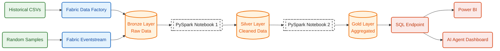
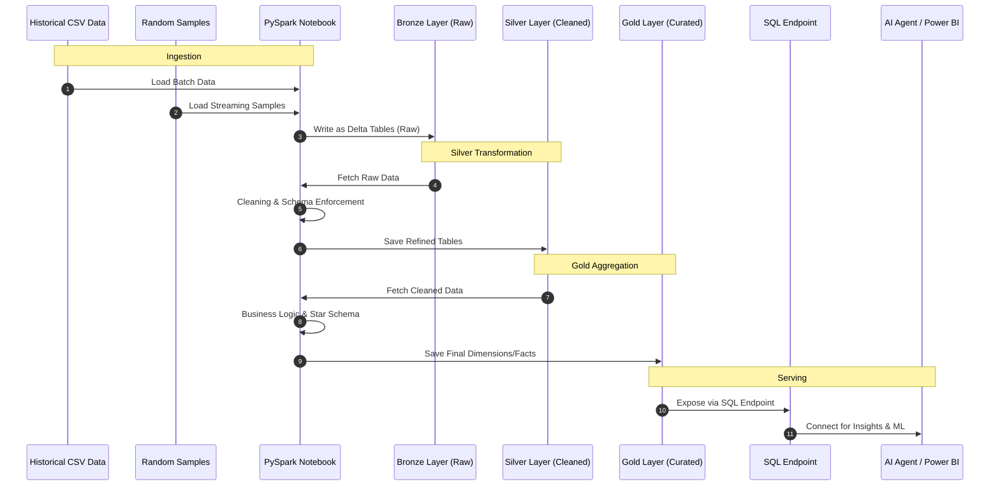

# Unified E-commerce ETL Ecosystem

> **End-to-End Data Integration & Scalable ODS Implementation for E-commerce Analytics**
> Built with **Microsoft Fabric (Medallion Architecture)**, **Apache Airflow**, **dbt**, **PySpark**, **Azure Event Hubs**, **Power BI**, and an **Azure AI Foundry** agent.

This repository delivers a complete, production-style data platform for an e-commerce business. It unifies **historical batch data** and **real-time streaming events** into a governed Lakehouse, models them into a **Galaxy Schema** Data Warehouse, and serves the insights through **Power BI dashboards** and an **AI conversational agent**.

---

## 📐 High-Level Architecture



The platform implements the **Medallion (Bronze → Silver → Gold)** pattern entirely inside Microsoft Fabric, with a parallel **on-premise** stack (Airflow + dbt + PostgreSQL/DuckDB) demonstrating the same business logic in an open-source environment.

---

## 🗂️ Repository Structure

```
unified-ecommerce-etl-ecosystem/
│
├── High-Volume-Ingestion/        # Batch ingestion of historical e-commerce data (Fabric)
│   ├── HistoricalData.ipynb      # PySpark notebook — raw → Bronze
│   ├── Bronze_to_Silver.ipynb    # Cleansing & schema enforcement
│   ├── Silver_to_Gold.ipynb      # Star schema & business aggregations
│   ├── HistLake.sqlproj          # SQL Database Project for the analytics endpoint
│   └── xmla.json                 # Semantic model / dataset metadata
│
├── Low-Volume-Ingestion/         # Real-time streaming pipeline (Fabric Eventstream)
│   ├── Generate Streaming Data.ipynb     # Faker-based event simulator → Event Hub
│   ├── Bronze to silver streaming.ipynb  # Structured Streaming refinement
│   ├── Silver to gold streaming.ipynb    # Real-time aggregation to Gold
│   └── eventstream.png                   # Eventstream topology screenshot
│
├── On_Prem/                      # Open-source parallel stack
│   ├── airflow/                  # Apache Airflow orchestration
│   │   ├── ecommerce_pipeline.py # DAG: extract → transform → load Galaxy Schema
│   │   ├── docker-compose.yml    # PostgreSQL container for the warehouse
│   │   ├── requirements.txt
│   │   └── .env                  # Airflow + timezone configuration (Africa/Cairo)
│   │
│   └── DBT/                      # dbt project (`G3_project`) on DuckDB
│       ├── dbt_project.yml
│       ├── stg_*.sql             # Staging models (views)
│       ├── dim_*.sql             # Dimension tables (SCD2-ready)
│       ├── fact_*.sql            # Fact tables (sales, reviews)
│       ├── schema,yml            # Tests & documentation
│       └── ODS.py                # DuckDB inspection helper
│
├── Visualization/
│   ├── Power BI/
│   │   └── Sales_Report.pbix     # Executive sales & reviews dashboard
│   └── ML Serving/
│       ├── template.json         # Azure ARM template — AI Foundry + App Service
│       └── AI_agent215.py        # Deployable conversational analytics agent
│
├── system-design/
│   ├── architecture-map.md       # End-to-end Mermaid architecture diagram
│   ├── sequence-diagram.md       # Functional execution sequence
│   ├── data_model.md             # Galaxy Schema ER diagram
│   └── Documentation/
│       ├── Unified E-Commerce ETL Ecosystem Presentation.pptx
│       ├── Fabric_Medallion_ECommerce_Platform_With_Azure_AI_Agent.pdf
│       └── Airflow & dbt Documentation.pdf
│
└── README.md                     # You are here
```

---

## 🧱 Medallion Architecture (Microsoft Fabric)

### 🟫 Bronze — Raw Landing Zone
| Source | Mechanism | Destination |
|---|---|---|
| Historical CSVs (orders, customers, products, reviews) | **Fabric Data Factory** pipelines | Delta tables in `HistLake` |
| Synthetic real-time events (clicks, sessions, transactions) | **Azure Event Hub → Fabric Eventstream `cust_stream`** | Delta tables in `LiveLake` |

### ⚪ Silver — Cleansed & Conformed
Performed by PySpark notebooks (`Bronze_to_Silver.ipynb`, `Bronze to silver streaming.ipynb`):
- Type casting, deduplication, null handling
- Schema enforcement and column standardization
- Late-arriving record handling for streaming

### 🟨 Gold — Curated Galaxy Schema
Performed by PySpark notebooks (`Silver_to_Gold.ipynb`, `Silver to gold streaming.ipynb`):
- Surrogate-key generation
- **SCD Type 2** on `DIM_CUSTOMER` and `DIM_PRODUCT`
- Two fact tables: `FACT_SALES`, `FACT_REVIEWS`
- Conformed `DIM_DATE` shared across facts

---

## ⭐ Data Warehouse — Galaxy Schema

```mermaid
erDiagram
    DIM_CUSTOMER ||--o{ FACT_SALES   : "purchases"
    DIM_CUSTOMER ||--o{ FACT_REVIEWS : "writes"
    DIM_PRODUCT  ||--o{ FACT_SALES   : "is sold"
    DIM_PRODUCT  ||--o{ FACT_REVIEWS : "is reviewed"
    DIM_DATE     ||--o{ FACT_SALES   : "order_date"
    DIM_DATE     ||--o{ FACT_REVIEWS : "review_date"

    DIM_CUSTOMER { int customer_key PK; int customer_id; string name; string email; string gender; string country; date start_date; date end_date; boolean is_current }
    DIM_PRODUCT  { int product_key PK; int product_id; string product_name; string category; string brand; decimal price; date effective_price_start_date; date effective_price_end_date; boolean is_current }
    DIM_DATE     { int date_key PK; date full_date; int year; int quarter; int month_number; string month_name; int day_of_week; string day_name; boolean is_weekend }
    FACT_SALES   { int order_item_id PK; int customer_key FK; int product_key FK; int order_date_key FK; int order_id; int quantity; decimal unit_price; decimal total_amount; string payment_method }
    FACT_REVIEWS { int review_id PK; int customer_key FK; int product_key FK; int review_date_key FK; int rating; string review_text }
```

A **Galaxy (constellation) Schema** was chosen over a single star because two business processes — **sales transactions** and **product reviews** — share conformed `DIM_CUSTOMER`, `DIM_PRODUCT`, and `DIM_DATE` dimensions, enabling cross-process analytics (e.g., "Do high-rating customers spend more?").

---

## 🛠️ Technology Stack

| Layer | Cloud (Microsoft Fabric) | On-Prem / Open Source |
|---|---|---|
| **Ingestion** | Fabric Data Factory, Azure Event Hubs, Fabric Eventstream | Python file-based extract |
| **Storage** | OneLake (Delta Lake) Bronze/Silver/Gold | PostgreSQL 14 / DuckDB |
| **Processing** | PySpark Notebooks (Structured Streaming + Batch) | Pandas (Airflow), dbt SQL |
| **Orchestration** | Fabric Pipelines | **Apache Airflow** (`@dag`, Astro Runtime) |
| **Modeling** | SQL Analytics Endpoint, XMLA semantic model | **dbt-duckdb** (`G3_project`) |
| **Serving** | Power BI direct on SQL Endpoint | Power BI on PostgreSQL |
| **AI / ML** | Azure AI Foundry agent (`foundryrgecom`) + App Service | — |

---

## ⚙️ The Two Parallel Stacks

### 1. ☁️ Cloud Stack — Microsoft Fabric
End-to-end on Microsoft Fabric implementing the Medallion architecture. Detailed in:
- `High-Volume-Ingestion/` — batch path (`HistoricalData → Bronze_to_Silver → Silver_to_Gold`)
- `Low-Volume-Ingestion/` — streaming path (`Generate Streaming Data → Bronze to silver streaming → Silver to gold streaming`)
- `system-design/Documentation/Fabric_Medallion_ECommerce_Platform_With_Azure_AI_Agent.pdf`

### 2. 🖥️ On-Prem Stack — Airflow + dbt
A mirrored, open-source implementation of the same Galaxy Schema for portability and education.

**Airflow DAG (`etl_galaxy_schema`)** at `On_Prem/airflow/ecommerce_pipeline.py`:
- 5 parallel `extract_*` tasks read source CSVs from `/usr/local/airflow/include/raw_data`
- A single `transform` task builds `dim_customer`, `dim_product`, `dim_date`, `fact_sales`, `fact_reviews` in Pandas
- A `load` task writes the modeled tables back to CSV (swap-in target: PostgreSQL via SQLAlchemy)
- Timezone: **Africa/Cairo**, schedule `None` (manual trigger), tags `["etl", "galaxy_schema", "ecommerce"]`

**dbt project (`G3_project`)** at `On_Prem/DBT/`:
- Staging models (`stg_customers`, `stg_orders`, `stg_order_items`, `stg_products`, `stg_product_reviews`) materialized as views
- Dimensions and facts materialized as tables with SCD2 flags
- Target: DuckDB (see `ODS.py` for inspection)

---

## 📊 Serving Layer

### Power BI — `Visualization/Power BI/Sales_Report.pbix`
Executive dashboard built on the SQL Endpoint with drill-downs across customer geography, product category, and time intelligence over `DIM_DATE`.

### AI Agent — `Visualization/ML Serving/`
A conversational analytics agent provisioned via the ARM template (`template.json`) deploying:
- **Azure AI Foundry** account (`foundryrgecom`, region `swedencentral`)
- **App Service** (`ecom`) hosting the Python agent (`AI_agent215.py`)
- **Application Insights** + Smart Detection
- Storage accounts for state and artifacts

Users query natural-language questions ("Top 5 products in Q1 by revenue?") and the agent issues SQL against the Gold layer.

---

## 🚀 Getting Started

### Prerequisites
- A Microsoft Fabric tenant with Lakehouse, Eventstream, and Data Factory enabled
- Docker Desktop (for the on-prem PostgreSQL container)
- [Astronomer CLI](https://docs.astronomer.io/astro/cli/install-cli) or a local Airflow 2.10+ environment
- Python 3.10+, `dbt-duckdb`, `pandas`, `pyspark`
- Azure subscription (for the AI agent deployment)

### Running the On-Prem Stack

```bash
# 1. Start the PostgreSQL warehouse
cd On_Prem/airflow
docker compose up -d

# 2. Launch Airflow (Astro project layout assumed)
astro dev start              # serves UI at http://localhost:8080
# Trigger the DAG: etl_galaxy_schema

# 3. Run dbt models
cd ../DBT
dbt deps
dbt seed         # loads source CSVs as seeds
dbt run          # builds staging, dimensions, facts
dbt test         # runs schema tests defined in schema,yml
```

### Running the Fabric Stack
1. Import the notebooks in `High-Volume-Ingestion/` and `Low-Volume-Ingestion/` into a Fabric workspace.
2. Deploy `HistLake.sqlproj` to create the Bronze schema.
3. Configure the Event Hub connection string inside `Generate Streaming Data.ipynb`.
4. Schedule the batch chain (`HistoricalData → Bronze_to_Silver → Silver_to_Gold`) via Fabric Pipelines.
5. Start the streaming notebooks for `cust_stream`.
6. Connect Power BI to the SQL Analytics Endpoint exposed by the Gold Lakehouse.

### Deploying the AI Agent
```bash
az group create --name rg-ecom --location swedencentral
az deployment group create \
  --resource-group rg-ecom \
  --template-file Visualization/ML\ Serving/template.json
```

---

## 🔁 Execution Sequence



---

## 📚 Documentation

| File | Purpose |
|---|---|
| `system-design/architecture-map.md` | End-to-end architecture diagram |
| `system-design/sequence-diagram.md` | Process execution sequence |
| `system-design/data_model.md` | Galaxy Schema ER diagram |
| `system-design/Documentation/Unified E-Commerce ETL Ecosystem Presentation.pptx` | Project presentation |
| `system-design/Documentation/Fabric_Medallion_ECommerce_Platform_With_Azure_AI_Agent.pdf` | Deep dive on the Fabric + AI Agent path |
| `system-design/Documentation/Airflow & dbt Documentation.pdf` | Deep dive on the on-prem path |

---

## ✨ Highlights

- **Two delivery paths, one data model** — identical Galaxy Schema on cloud (Fabric) and on-prem (Airflow + dbt) for portability and reproducibility.
- **Hybrid ingestion** — batch (Data Factory + CSV) and streaming (Event Hub + Eventstream) feeding a single Bronze layer.
- **SCD Type 2 dimensions** — historical accuracy on customers and product prices.
- **Conformed dimensions across two fact tables** — enables cross-domain analysis (sales × reviews).
- **AI-native serving** — natural-language analytics over the warehouse via an Azure AI Foundry agent.

---

## 👤 Author

**Basant Ali Team Leader** — Data Engineering / Analytics Engineering
