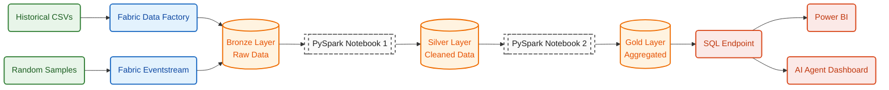

# Technical Architecture: End-to-End Medallion Data Pipeline via Microsoft Fabric

## 1. High-Level Data Flow
This diagram represents the unified ecosystem for processing e-commerce data

```mermaid
graph LR
    %% Styles
    classDef source fill:#e8f5e9,stroke:#2e7d32,stroke-width:2px,color:#1b5e20
    classDef ingestion fill:#e3f2fd,stroke:#1565c0,stroke-width:2px,color:#0d47a1
    classDef storage fill:#fff3e0,stroke:#ef6c00,stroke-width:2px,color:#e65100
    classDef compute fill:#fafafa,stroke:#616161,stroke-width:2px,color:#212121,stroke-dasharray: 5 5
    classDef serving fill:#fbe9e7,stroke:#d84315,stroke-width:2px,color:#bf360c

    %% Nodes
    A(Historical CSVs):::source
    B(Random Samples):::source
    C(Fabric Data Factory):::ingestion
    D(Fabric Eventstream):::ingestion
    E[(Bronze Layer<br/>Raw Data)]:::storage
    H[[PySpark Notebook 1]]:::compute
    F[(Silver Layer<br/>Cleaned Data)]:::storage
    I[[PySpark Notebook 2]]:::compute
    G[(Gold Layer<br/>Aggregated)]:::storage
    J(SQL Endpoint):::serving
    K(Power BI):::serving
    L(AI Agent Dashboard):::serving

    %% Flow
    A --> C --> E
    B --> D --> E
    E --> H --> F
    F --> I --> G
    G --> J
    J --> K
    J --> L
```
