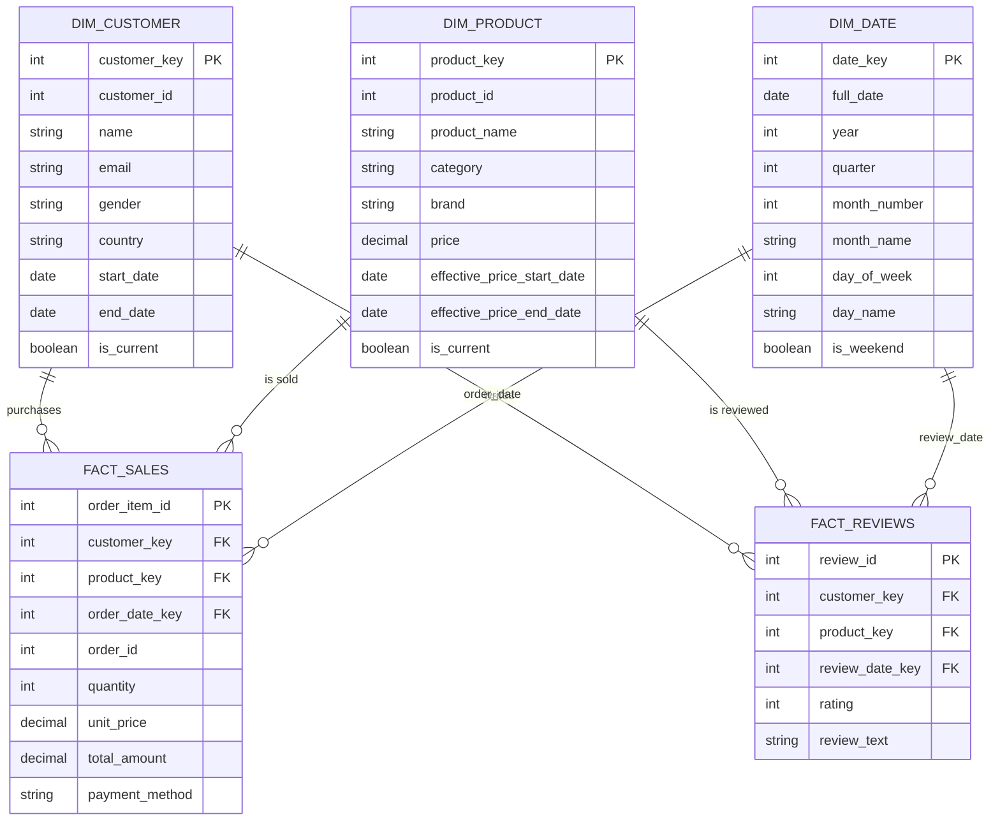

# Data Warehouse Architecture

This diagram illustrates the **Galaxy Schema** designed for the Unified E-commerce ETL Ecosystem. It supports multi-source data integration and maintains historical data using SCD Type 2.

