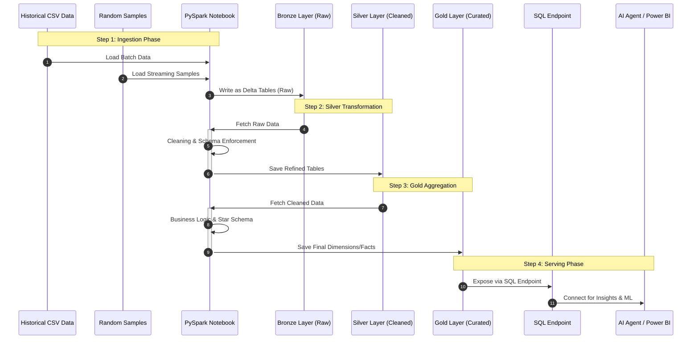

# Process Execution Sequence: End-to-End Data Flow

This diagram illustrates the functional orchestration of the data pipeline. It highlights how **PySpark Notebooks** act as the central engine, pulling data from various sources and moving it through the Medallion layers within **Microsoft Fabric**.

## 1. Sequence Diagram

